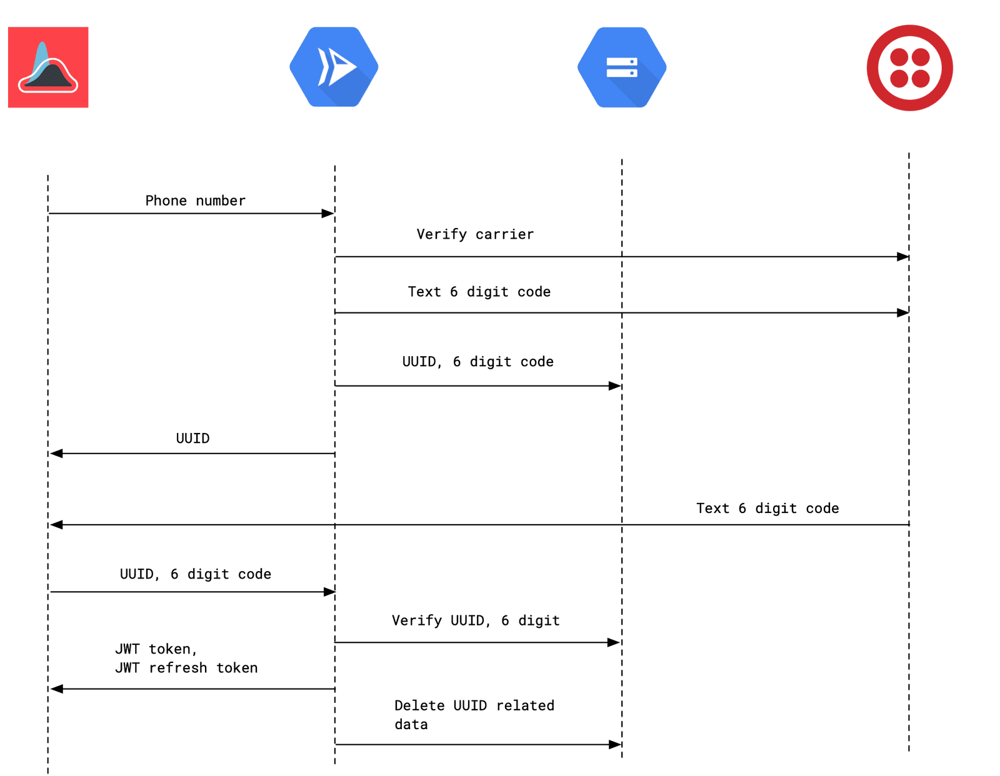

# covidtrace/operator

Operator is the service that handles cell phone verification for COVID Trace.
At a high level, Operator provides an API for verifying a user cell phone number and issuing/refreshing JWT tokens.

## Diagram



## Details

Operator ensures that a user has a valid cell phone number and issues JWT tokens with a cryptographic identifier derived from this phone number. In the tokens below, that is the `covidtrace:hash` value. It is useful to produce tokens this way to help mitigate abuse of the system; for example, rate limiting a specific user.

In order to achieve this in a way that best preserves user privacy, Operator computes a SHA512 hash of a salt combined with all the relevant information Twilio returns for a phone number. This is designed to be difficult to reverse and simple to alter in the case that multiple different entities want to run instances of Operator (by selecting a different salt).

All of the configuration necessary to run Operator can be specified using environment variables. This is to support deployment to a wide variety of platforms. Operator is also completely stateless so it can be scaled horizontally.

## API

### POST /init

This request is used to initiate a verification session. Operator handles computing a hash of the phone number details, generates a verification code, stores a file in Cloud Storage with the relevant metadata and returns a token that identifies that file. That token, combined with the verification code (delivered via text message) are used in the next request to obtain JWT tokens.

```
curl -XPOST https://covidtrace-operator.domain/init -d '{"phone": "1234567890"}'
{"token": "a8b46109-16ce-4da8-b46f-fcf7ae9b6511"}
```

### POST /verify

As alluded to above, this request completes the verification session. Operator removes files from Cloud Storage so they cannot be used to obtain tokens more than once. It is also highly recommended to use a Cloud Storage lifecycle rule to remove files older than one day as an extra precaution.

```
curl -XPOST https://covidtrace-operator.domain/verify -d '{"token": "a8b46109-16ce-4da8-b46f-fcf7ae9b6511", "code": "123456"}'
{"token":"JWT_TOKEN","refresh":"JWT_REFRESH_TOKEN"}
```

Decoded JWT_TOKEN:

```
{
  "covidtrace:hash": "Bst1NCYn14WjDSMYCjFuH4/uHaK8rZXK0HzmCn0hF3k9ZeFFhV8Nb1SjnPFRzj4aJbQw7V6Gmb6JPBC77Wlhew==",
  "covidtrace:refreshed": 0,
  "aud": "covidtrace/token",
  "exp": 1586447103,
  "iss": "covidtrace/operator"
}
```

Decoded JWT_REFRESH_TOKEN:

```
{
  "covidtrace:hash": "Bst1NCYn14WjDSMYCjFuH4/uHaK8rZXK0HzmCn0hF3k9ZeFFhV8Nb1SjnPFRzj4aJbQw7V6Gmb6JPBC77Wlhew==",
  "covidtrace:refreshed": 0,
  "aud": "covidtrace/refresh",
  "exp": 1593701103,
  "iss": "covidtrace/operator"
}
```

### POST /refresh

This request is used to refresh a set of JWT tokens. In practice, the expiration of tokens should be much sooner than that of refresh tokens.

```
curl -XPOST 'https://covidtrace-operator.domain/refresh?code=REFRESH_JWT_TOKEN'
{"token":"JWT_TOKEN","refresh":"JWT_REFRESH_TOKEN"}
```

## Deploying

COVID Trace leverages Google Cloud for its infrastructure needs. In particular, Operator is deployed as a Cloud Run service with a set of environment variables. We have deployed Operator as a private service behind a [rate limiting proxy](https://github.com/covidtrace/proxy) to protect against abuse. The following environment variables are required.

```
CLOUD_STORAGE_BUCKET="bucket to store token files"
JWT_NAMESPACE="name to prepend to `iss` and `aud` claims"
JWT_SIGNING_KEY="some long random key used to sign JWTs"
JWT_TOKEN_DURATION="1h"
JWT_REFRESH_DURATION="504h"
HASH_SALT="some long random key used to differentiate hashes"
TWILIO_ACCOUNT_SID="twilio account identifier"
TWILIO_AUTH_TOKEN="twilio account authentication token"
TWILIO_FROM_NUMBER="twilio phone number used to send SMS"
```